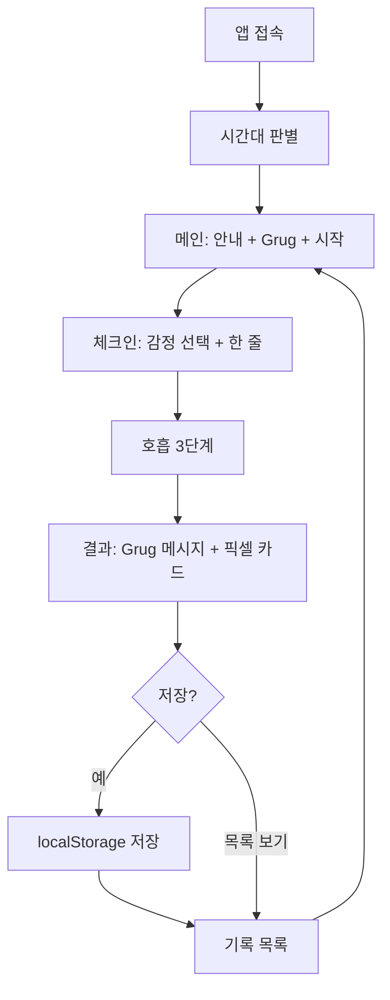

# My Calm — Pixel Grug 설계서

> 문서 역할: **구현 전에 보는 설계서** (SDD)  
> 근거: `docs/planning.md` + `docs/technical-spec.md` (PDF: `my_calm_pixel_grug_*.pdf`)  
> 현재 기준 에셋: `assets/anchor-grug.png` **하나**  
> 상태: 설계만 · **앱 코드 미구현**

---

## 1. 앱 개요

| 항목 | 내용 |
|------|------|
| 이름 | My Calm — Pixel Grug |
| 한 줄 | 새벽 산행처럼 오늘의 마음을 짧게 바라보고, Grug와 1분 안에 픽셀 카드로 남기는 앱 |
| 본질 | Calm 대체 앱이 **아님**. 긴 수면/명상 콘텐츠 앱이 **아님** |
| MVP | **짧은 호흡 + Grug 체크인 + 픽셀 카드 기록** |
| 스택 | HTML + CSS + JavaScript + `localStorage` |
| 배포 | GitHub Pages 가능 구조 (정적 파일) |

원칙: 감정을 고치지 않는다. Grug는 판단하지 않는다. 오늘 마음을 작은 카드로 남긴다.

---

## 2. 사용자 흐름



1. 접속 → 시간대 안내  
2. 감정 선택 → 한 줄 입력  
3. 짧은 호흡 (들이쉬기 → 멈춤 → 내쉬기)  
4. Grug 메시지 + 카드 미리보기  
5. 저장 → 목록에서 다시 보기 / 삭제  

목표 소요: **약 1분**

---

## 3. 화면 구성

| 화면 ID | 이름 | 목적 |
|---------|------|------|
| `home-screen` | 메인 | 정체성·시간대 문구·시작 |
| `checkin-screen` | 체크인 | 감정·한 줄 입력 |
| `breathing-screen` | 호흡 | 3단계 텍스트 타이머 |
| `result-screen` | 결과 카드 | 카드 확인·저장 |
| `history-screen` | 기록 목록 | 누적 카드·삭제 |

구현 방식: **SPA 섹션 전환** (`.screen` / `.screen.active`). 라우터 없음.

---

## 4. 화면별 UI 요소

### 4.1 메인 (`home-screen`)
- 제목: My Calm — Pixel Grug
- 한 줄 소개
- `assets/anchor-grug.png` (pixelated)
- 시간대 안내 문구
- [시작하기] → 체크인
- [지난 카드 보기] → 기록 목록 (선택)

### 4.2 체크인 (`checkin-screen`)
- 시간대 문구
- 감정 버튼 7개: 평온 / 지침 / 불안 / 감사 / 집중 / 회복 / 시작
- 한 줄 `textarea` 또는 `input`
- [호흡 시작] (감정 미선택 시 안내)
- [뒤로]

### 4.3 호흡 (`breathing-screen`)
- 라운드 표시: `1/5` ~ `5/5`
- 단계 문구 + 카운트다운
- 단계: 들이쉬기 **3초** → 멈추기 **3초** → 내쉬기 **5초**
- 1회 11초 × **5회** ≈ 55초
- 완료 시 자동으로 결과 화면

### 4.4 결과 (`result-screen`)
- 픽셀 카드 UI
  - Grug 이미지 (`anchor-grug.png`)
  - 날짜 / 시간대 / 감정 / 한 줄 / Grug 메시지
- [카드 저장]
- [다시 체크인] / [기록 보기]

### 4.5 기록 (`history-screen`)
- 카드 리스트 (최신순)
- 카드별 [삭제]
- 빈 상태: “아직 남긴 마음 카드가 없습니다.”
- [홈으로]

### 시각 토큰 (요약)
| 토큰 | 값 |
|------|-----|
| 배경 | `#F0EEE6` (Warm Ivory) |
| Grug Brown | `#8B5A3C` |
| 텍스트 | `#2F241D` |
| 카드 | `#FFF8EC` |
| muted | `#A58A72` |

---

## 5. 상태 관리 구조

프레임워크 없이 `appState` 단일 객체.

```js
const appState = {
  currentScreen: "home",       // home | checkin | breathing | result | history
  timeSlot: null,              // morning | midday | nap | evening | night
  selectedEmotionId: null,     // calm | tired | ...
  userMessage: "",
  currentGrugMessage: "",
  breathingStep: 0,            // 설계 확장: 0~2
  cards: []                    // loadCards()로 동기화
};
```

| 상태 | 갱신 시점 |
|------|-----------|
| `timeSlot` | `initApp` / 화면 진입 시 |
| `selectedEmotionId` | 감정 버튼 클릭 |
| `userMessage` | 입력 변경 |
| `currentGrugMessage` | 호흡 완료 후 `getGrugMessage` |
| `cards` | 저장·삭제·초기 로드 |

---

## 6. 데이터 저장 구조

| 항목 | 값 |
|------|-----|
| 키 | `my-calm-pixel-grug-cards` |
| 형식 | JSON 배열 |
| 위치 | `localStorage` |

카드 스키마:

| 필드 | 타입 | 설명 |
|------|------|------|
| `id` | string | 예: `card-20260710-213000` |
| `date` | string | `YYYY-MM-DD` |
| `timeSlot` | string | morning…night |
| `emotionId` | string | calm, tired, … |
| `emotionLabel` | string | 평온, 지침, … |
| `userMessage` | string | 한 줄 (빈 값이면 기본 문구) |
| `grugMessage` | string | 선택된 Grug 문장 |
| `imagePath` | string | 항상 `assets/anchor-grug.png` |
| `createdAt` | string | ISO datetime |

CRUD:
- `saveCards(cards)` / `loadCards()` / `deleteCard(cardId)`
- 파싱 오류 시 `[]`로 초기화

---

## 7. 주요 함수 흐름

### 7.1 시작
`initApp()`  
→ `loadCards()` → `appState.cards`  
→ `getCurrentTimeSlot()` → `renderTimeGuide()`  
→ `showScreen("home-screen")`

### 7.2 체크인 → 호흡 → 결과
`selectEmotion(id)`  
→ (한 줄 입력)  
→ `startBreathing()`  
→ `updateBreathingStep()` × 3  
→ `getGrugMessage(emotionId, timeSlot)`  
→ `createCheckInCard()` (미리보기용)  
→ `showScreen("result-screen")`

### 7.3 저장·목록
`saveCard(card)` → `saveCards` → `renderCardList()`  
`deleteCard(id)` → 목록 갱신  
`resetCheckIn()` → 다음 체크인 준비

### 7.4 화면 전환
`showScreen(screenId)` — 모든 `.screen`에서 `active` 제거 후 대상만 활성화

---

## 8. 파일 구조

```
groom_260710_pixel-grug/
├── index.html                 # (구현 시) 5개 section
├── style.css                  # (구현 시) 토큰·카드·화면
├── script.js                  # (구현 시) 상태·흐름·storage
├── assets/
│   └── anchor-grug.png        # 유일한 기준 에셋
├── my_calm_pixel_grug_planning.pdf
├── my_calm_pixel_grug_technical_spec.pdf
├── README.md
├── VISUAL_IDENTITY.md
└── docs/
    ├── planning.md            # 기획서
    ├── technical-spec.md      # 기술명세서
    ├── design.md              # 본 설계서
    └── … (mission, requirements, benchmark 등)
```

---

## 9. 구현 순서

| 순서 | 작업 | 산출 |
|------|------|------|
| 1 | HTML 골격 5화면 | `index.html` |
| 2 | 시각 토큰·카드·버튼 | `style.css` |
| 3 | 시간대·안내 | `getCurrentTimeSlot`, `renderTimeGuide` |
| 4 | 감정·한 줄 | `selectEmotion`, 입력 바인딩 |
| 5 | 호흡 타이머 | `startBreathing`, `updateBreathingStep` |
| 6 | Grug 메시지 | `grugMessages`, `getGrugMessage` |
| 7 | 카드 생성·저장 | `createCheckInCard`, `saveCard` |
| 8 | 목록·삭제 | `renderCardList`, `deleteCard` |
| 9 | 예외·접근성·모바일 점검 | 테스트 표 |
| 10 | Pages 배포 준비 | README · commit/push는 **승인 후** |

---

## 10. 테스트 관점

| ID | 관점 | 확인 |
|----|------|------|
| T01 | 진입 | 메인·Grug 이미지 표시 |
| T02 | 시간대 | 시각별 문구 일치 |
| T03 | 입력 | 감정 필수, 한 줄 선택(빈 값 기본 문구) |
| T04 | 호흡 | 3-3-5 × 5회, `1/5`~`5/5`, 완료 후 결과 화면 |
| T05 | 메시지 | 감정별 Grug 문구 |
| T06 | 저장 | `localStorage` 키·스키마 |
| T07 | 지속성 | 새로고침 후 유지 |
| T08 | 목록 | 최신순·삭제 |
| T09 | 빈 상태 | 안내 문구 |
| T10 | 반응형 | 버튼·카드 깨짐 없음 |

---

## 11. 제외 범위

초기 MVP에서 **명시적으로 제외**:

- 로그인 / 회원가입 / 결제 / 구독 / 서버 DB
- B2B / Health
- 오디오 콘텐츠 / Sleep Stories / 셀럽 콘텐츠
- Gemini Nano Banana API / 실시간 이미지 생성 / 감정 분석 AI
- 푸시 알림 / 소셜 로그인
- 감정별 이미지 대량 생성 (현재 에셋은 `anchor-grug.png`만)

---

## 설계 체크리스트 (구현 진입 전)

- [x] planning.md 반영
- [x] technical-spec.md 반영
- [x] MVP 3요소 고정
- [x] 제외 범위 명시
- [ ] 주군 설계 승인
- [ ] 구현 착수 승인 (`index.html` 등)
